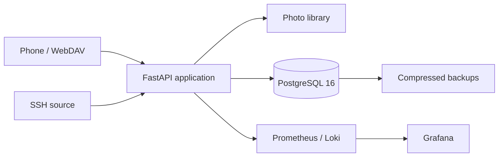

# Photos Sync

[](https://github.com/juanfranciscofernandezherreros/photos-python/actions/workflows/ci.yml)
[](https://www.python.org/)
[](LICENSE)

Self-hosted photo ingestion and management for WebDAV and SSH sources. Photos Sync downloads media, organizes it by capture date, indexes metadata in PostgreSQL, and provides a responsive web gallery with albums, favorites, trash, users, and operational monitoring.

## Highlights

- Concurrent WebDAV downloads with per-file progress, retry, and HTTP Range resume.
- SSH ingestion with parallel scanning, retries, and reconnection.
- PostgreSQL 16, versioned Alembic migrations, indexed capture dates, and batched writes.
- FastAPI dashboard with role-based access, rate limiting, and secure sessions.
- Prometheus, Grafana, Loki, and provisioned operational alerts.
- Automated backups plus an isolated restore test.
- Ruff, mypy, branch coverage above 80%, PostgreSQL integration tests, and Serenity BDD reports containing sanitized requests and responses.
- Non-root application container and an optional Caddy HTTPS deployment.

## Architecture



## Quick start

Requirements: Docker Engine with Docker Compose and Python 3.11+ for helper scripts.

```bash
cp .env.example .env
python scripts/generate_secrets.py
docker compose up -d --build
```

Open <http://localhost:8765> and create the first administrator account. Check the deployment with:

```bash
docker compose ps
curl --fail http://localhost:8765/health
```

Start the complete monitoring stack with:

```bash
docker compose --profile monitoring up -d --build
```

| Service | Address |
|---|---|
| Photos Sync | <http://localhost:8765> |
| Grafana | <http://localhost:3000> |
| Prometheus | <http://localhost:9090> |

pgAdmin is available through the optional `admin` profile:

```bash
docker compose --profile admin up -d
```

## WebDAV performance and recovery

Downloads run concurrently and each active file is written to a stable `.webdav.part` file. If connectivity is interrupted, the next attempt asks the server for only the missing byte range. Servers without Range support remain compatible: the affected file restarts safely. Overlapping remote roots are collapsed before discovery to avoid repeated `PROPFIND` scans.

| Setting | Default | Purpose |
|---|---:|---|
| `WEBDAV_DOWNLOAD_WORKERS` | `32` | Stress profile; reduce to `8-16` if the phone or Wi-Fi saturates. |
| `WEBDAV_CHUNK_SIZE_KB` | `2048` | Streaming chunk size that reduces Python overhead for large media. |
| `WEBDAV_DB_BATCH_SIZE` | `250` | Number of completed files persisted per database batch. |

Do not set worker counts blindly: phone storage, Wi-Fi, and the WebDAV server often become slower under excessive parallelism. See [WebDAV operations](docs/webdav.md) for tuning and recovery details.

## Configuration

Copy `.env.example` and keep real credentials only in generated files under `secrets/`. Important settings include:

| Variable | Default | Description |
|---|---|---|
| `PHOTOS_DIR` | `./photos` | Host photo-library directory. |
| `APP_PORT` | `8765` | Web application port. |
| `APP_BIND_IP` | `127.0.0.1` | Published application interface. |
| `DB_BIND_IP` | `127.0.0.1` | Published PostgreSQL interface. |
| `SECRETS_DIR` | `./secrets` | Local Docker Secrets directory. |
| `APP_UID` / `APP_GID` | `1000` | Non-root container identity on Linux hosts. |

On Linux, make the library writable by the configured identity. Never solve permission problems by running the application as root.

## Updates and database migrations

```bash
git pull
docker compose up -d --build --force-recreate
```

The application applies pending Alembic revisions before serving traffic and stops if a migration fails. Back up the database before upgrading. Existing JSON data can be imported with:

```bash
docker compose exec app python migrations/import_from_json.py
```

## Backups

The `backup` service creates compressed PostgreSQL dumps every 24 hours in `BACKUP_DIR` and retains them for `BACKUP_KEEP_DAYS` (seven by default).

Run the isolated dump-and-restore verification without modifying the production database:

```bash
docker compose cp scripts/test_backup_restore.sh db:/tmp/test_backup_restore.sh
docker compose exec -T db sh /tmp/test_backup_restore.sh
```

Operational procedures are documented in [Operations](docs/operations.md).

## Development and quality gates

```bash
python -m pip install -e ".[dev,ssh,images]"
python -m ruff check .
python -m mypy photos_sync
python scripts/check_english.py
python -m pytest tests -q --cov=photos_sync --cov-branch --cov-report=term-missing --cov-report=html --cov-report=xml --cov-fail-under=80
```

Coverage HTML is written to `reports/coverage/index.html`. Run the endpoint contract suite with:

```bash
cd serenity
./mvnw verify       # Linux/macOS
mvnw.cmd verify     # Windows
```

Its report is generated at `serenity/target/site/serenity/index.html`. Every API and WebSocket route must have a scenario; request and response data is included with passwords, cookies, and authorization data redacted.

Project documentation, new comments, user-facing messages, issues, and pull requests must be written in English. Historical Spanish API paths, field names, and role values remain stable for backward compatibility.

## Deployment and documentation

- [Architecture](docs/architecture.md)
- [Operations and backups](docs/operations.md)
- [WebDAV tuning and recovery](docs/webdav.md)
- [HTTPS with Caddy](docs/https.md)
- [Contribution guide](CONTRIBUTING.md)
- [Security policy](SECURITY.md)
- [Roadmap](BACKLOG.md)

Do not expose port `8765` directly to the public Internet. Use the documented Caddy deployment or a private VPN.

## License

Photos Sync is available under the [MIT License](LICENSE).
